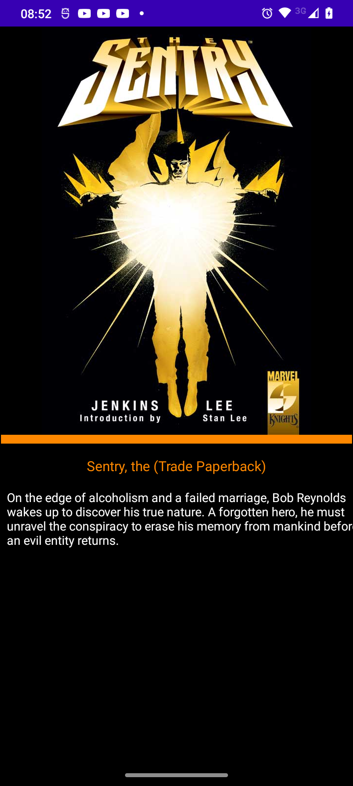

# MarvelApp


Aplicacion de Marvel para mostrar personajes, se usa el patron de diseno MVP con RecyclerView en Fragments y SplashScreen tipo Netflix para cargado de lo datos del back end. La aplicacion tambien utiliza  Picasso para mostrar las imagenes del backend. Otra caracteristica importante es que para comunicacion en los fragments para compartir el persnaje que se toque en el Recyclerview, usamos **androidx.navigation.safeargs** el cual es recomendado para compartir objetos entre fragments.


    Para   crear la api de acceso utilizamos **Retrofit**, con el que se construye  el api de acceso.



Igualmente nos apoyamos de retrofit para hacer el  testing de la **REST API** de Marvel, en este caso se hace una prueba para probar el acceso de la api con retrofi y vrificar que el estatus de respuesta es 200 (OK) para confirmar la recepcion del objeto Modelo de la api.
Para crear la assercion nos apoyamos de un servidor tipo Mock el cual posee un mock local del objeto remoto. A continuacion s emuestra el codio, que se encuentra en la carpeta unitTest del proyecto.

```
 @Before
    fun setUp() {
        MockitoAnnotations.initMocks(this)
        mockWebServer = MockWebServer()
        mockWebServer?.start()
    }


    @Test
    fun `leer muestra o mocking del json del request`(){
        
        var  mockedResponse = MockFileReader("success_response.json").content

        assertNotNull(mockedResponse)
    }


    //Probamos que la respuesta del servidor sea igual a la del mock
    @Test
    fun `leer y contrstar del json del request`(){

        // Servidor mocking
        val response = MockResponse()
            .setResponseCode(HttpURLConnection.HTTP_OK)
            .setBody(MockFileReader("success_response.json").content)
        mockWebServer?.enqueue(response)

        //Servidor real
        val characterMarvel = ClienteAPI.getApi()?.getCharacterMarvel(
            TS,
            API_KEY,
            HASH
        )?.execute()?.body()!!

        assertEquals(response.toString().contains("200"),
            characterMarvel.code.toString().contains("200"))

    }
```


## Dependencias

 Las dependencias  utiliazas en el pryecto son las siguientes


```
//REtrofit
    implementation 'com.squareup.retrofit2:retrofit:2.9.0'
    implementation 'com.squareup.retrofit2:converter-jackson:2.9.0'

    //Para retrofit testing
    implementation 'com.squareup.okhttp3:logging-interceptor:3.12.1'
    //MockWebserver
    testImplementation('com.squareup.okhttp3:mockwebserver:4.9.1')

    //implementos las corutinas para conetcarnos al back.end
    implementation 'org.jetbrains.kotlinx:kotlinx-coroutines-android:1.3.9'

    //Picasso para las imagenes
    implementation 'com.squareup.picasso:picasso:2.71828'

    implementation 'androidx.navigation:navigation-fragment-ktx:2.4.2'
    implementation 'androidx.navigation:navigation-ui-ktx:2.4.2'

    testImplementation 'junit:junit:4.13.2'
    androidTestImplementation 'androidx.test.ext:junit:1.1.3'
    androidTestImplementation 'androidx.test.espresso:espresso-core:3.4.0'

    //Mockito
    testImplementation 'org.mockito:mockito-core:1.3'
```

